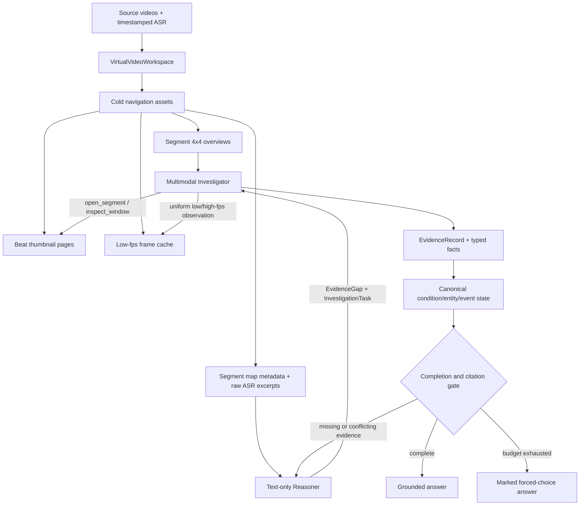

# VCAH

**Visual Coding Agent Harness** is a research framework for agentic long-video
understanding. Its main path treats a video collection like an unfamiliar codebase:
the Agent starts from a compact map, explores selected regions, records immutable
evidence, and verifies whether the evidence is sufficient before answering.

The current system is the **Virtual Video Multi-Round Investigation** framework. It
supports complete videos, virtual concatenations, and interleaved multi-video
timelines through the same workspace abstraction.

> Browse, observe, commit, and verify. Do not replace watching with a precomputed
> semantic summary.

## Research Goal

Most long-video systems first caption or summarize every clip, build a semantic
index, and retrieve from that derived memory. This is efficient for broad queries,
but details omitted during preprocessing cannot be recovered later.

VCAH studies a different operating point:

- No query-independent semantic captions, summaries, or embedding memory are
  required before a question arrives.
- Mechanical cold assets are allowed: virtual-time manifests, low-fps frames,
  thumbnail grids, and timestamped raw ASR.
- The Reasoner starts from a coarse segment map rather than top-k retrieved beats.
- The Investigator owns all beat- and frame-level access.
- Runtime memory is built from observations made for the current question.
- Every accepted claim retains virtual-time and source-time lineage.

Raw ASR is treated like repository-wide lexical `grep`: it is optional navigation
over original timestamped data, not semantic evidence by itself. Visual or joint
claims still require inspected visual evidence.

## Architecture



### 1. Virtual video workspace

`VirtualVideoWorkspace` maps every virtual interval back to one or more source
videos. No concatenated MP4 is required. A complete video is simply a workspace
with one segment; a six-hour interleaved case may contain many segments from
different source videos.

All navigation uses virtual time. Frames, ASR cues, observations, and final
evidence also preserve source video ids and source timestamps.

### 2. Overview-first Reasoner

The initial workspace overview is capped at 40 uniformly sampled 4x4 segment or
overview-group grids. The current text-only Reasoner receives the corresponding
coarse map metadata rather than image pixels:

- question and answer options;
- workspace duration;
- generic segment ids and virtual ranges;
- short raw ASR excerpts associated with those coarse ranges;
- paths identifying the bounded overview packet;
- the current evidence dashboard and remaining task budget.

It does **not** receive the gold answer, target/distractor roles, target interval,
all beat thumbnails, frame paths, or default top-k retrieval results. Overview
images remain available to the multimodal Investigator and trace viewer rather
than being sent to the Reasoner API.

The Reasoner emits an `EvidenceGap` and up to four `InvestigationTask` objects per
round. A task states what must be established, where to inspect, the expected
evidence, and any coverage or aggregation requirement.

### 3. Investigator-owned detail access

The public visual protocol is deliberately small:

- `open_segment(segment_id)`: returns local ASR, beat ranges, beat thumbnail
  grids, and lineage for navigation.
- `inspect_window(start, end, fps)`: uniformly samples the requested virtual
  window, returns timestamped frames and local ASR, and writes an observation.

The Investigator first uses coarse 0.5-fps evidence, chooses a narrower region,
and escalates to 1 or 2 fps when fine action, OCR, number, spatial, or identity
evidence is needed. A window is capped at 64 uniformly distributed frames. Detail
frames are materialized on demand under `observations/`; they never pollute the
low-fps cold cache.

Literal `search_asr` is available as a bounded navigation action. Its result is a
`navigation_hint`, so the Reasoner must dispatch a visual inspection before using
it to close a visual evidence gap.

### 4. Typed evidence and state

Free-form summaries are retained for readability, but verification is based on
structured records:

- `EvidenceRecord`: modality, claim, polarity, temporal scope, coverage, frame
  witnesses, parent evidence, confidence, and source lineage.
- `GapCondition` / `ConditionState`: monotonic satisfied, refuted, conflicted, or
  unresolved state with explicit scope and quantifier.
- `MeasurementFact`: value, unit, cumulative/delta semantics, subject, event, and
  boundary relation.
- `RelationFact`: subject, object, relation type, reference frame, and same-frame
  witnesses.
- Entity observations and clusters for distinct-person questions.
- Event observations and conservative event clusters for total-count questions,
  including participant ids, event class, counting unit, and phase.

The query compiler identifies broad contracts such as local-window lookup,
full-video coverage, distinct-entity counting, event aggregation, scalar
measurement, temporal transition, and spatial relation. A local observation cannot
silently satisfy a full-video condition, and conflicting observations remain
visible rather than being overwritten by the latest summary.

### 5. Multi-round control

`VirtualVideoMultiRoundDriver` maintains a bounded evidence dashboard and repeats:

1. Compile or update the unresolved evidence gap.
2. Ask the Reasoner for bounded investigation tasks.
3. Split cross-segment windows into source-contained child tasks.
4. Run the Investigator and append immutable evidence.
5. Update condition, candidate-option, entity, event, and coverage state.
6. Answer, repair a failed proof, or continue exploring.

The default library budget is four rounds, at most four tasks per round, and at
most 20 accepted tasks total. Frame count and VLM calls are recorded as cost but do
not consume the task budget. Equivalent observations can be reused using
goal-aware source-window overlap rather than exact floating-point cache keys.

## Answer Semantics

Answer accuracy and evidence completeness are reported separately:

| Mode | Meaning |
| --- | --- |
| `grounded` | The selected answer, citations, modality, scope, coverage, and typed facts pass the deterministic completion gate and final audit. |
| `forced_choice` | The task budget ended without a complete proof; the model still returns its best benchmark option, explicitly marked unverified. |
| `insufficient` | No usable final answer was produced. |

The run summary includes `selected_option`, `answer_mode`, `grounding_status`,
`retrieval_status`, `verified`, citations, and the verification reason. A forced
choice is never presented as grounded evidence.

## Workspace Artifacts

```text
workspace/
  virtual_timeline.json       segment order and virtual/source offsets
  case.json                   question, options, and evaluator-only metadata
  frame_manifest.jsonl        low-fps frame cache only
  asr_virtual_cues.json       raw ASR remapped to virtual time
  segment_overviews/          coarse 4x4 workspace navigation maps
  beat_thumbnails/            Investigator beat-level navigation grids
  beat_index.json             beat metadata and source lineage
  cold_index/                 derived runtime navigation artifact
  observations/
    window_frame_manifest.jsonl  on-demand observation frames
  evidence.jsonl              immutable evidence records
  exploration_ledger.jsonl    visits, reuse, and source coverage
  interactions.jsonl          prompts, model outputs, usage, and tool trace
  run_summary.json            final answer, grounding status, cost, and metrics
```

The manifest, frame manifest, ASR cues, beat index, and observation manifest are
the lineage truth sources. The cold index is rebuildable.

## Quick Start

### Requirements

- Python 3.9+
- `ffmpeg` and `ffprobe`
- `requests` and `PyYAML` for the interactive API runner
- An OpenAI-compatible text Reasoner endpoint and multimodal Investigator endpoint
  for real evaluation

```bash
python -m pip install -e '.[dev]'
python -m pip install requests PyYAML
pytest -q
```

### Build and index the three Video-MME smoke workspaces

```bash
python main.py vv-build-videomme \
  --dataset-root /path/to/Video-MME/snapshot \
  --out-dir runs/videomme-smoke \
  --seed 20260707

python main.py vv-index \
  --workspace runs/videomme-smoke/477-2 \
  --low-fps 0.1 \
  --beat-sec 60
```

`main.py vv-run` exercises the deterministic library protocol. Real dual-model
experiments use the interactive runner below.

### Configure separate Reasoner and Investigator models

Each role accepts a small YAML file:

```yaml
planner_api:
  base: https://example.invalid/v1
  model: your-model-name
  api_key: your-api-key
  timeout: 300
  max_retries: 5
  retry_base_sec: 1
  retry_max_sec: 30
  retry_jitter: 0.2
```

The current evaluation setup uses a GPT reasoning model for the text-only
Reasoner and Gemini 2.5 Pro for the multimodal Investigator. They may point to
different OpenAI-compatible gateways. GPT-5-family completion usage, finish
reason, and hidden reasoning-token counts are preserved in the trace so a token
budget failure is not misclassified as evidence failure.

### Run one or more Video-MME Long cases

```bash
python tools/run_virtual_videomme_interactive.py \
  --dataset-root /path/to/Video-MME/snapshot \
  --out-root runs/videomme-long \
  --case-ids 742-3 606-3 \
  --construction source_only \
  --reasoner-config /path/to/reasoner.yaml \
  --investigator-config /path/to/investigator.yaml \
  --low-fps 0.1 \
  --beat-sec 60 \
  --max-rounds 6 \
  --max-investigations 20 \
  --workers 2
```

For a reproducible group, pass `--case-group`, for example:

```bash
python tools/run_virtual_videomme_interactive.py \
  --dataset-root /path/to/Video-MME/snapshot \
  --out-root runs/regression50 \
  --case-group configs/eval_groups/videomme_long_regression50_v1.json \
  --reasoner-config /path/to/reasoner.yaml \
  --investigator-config /path/to/investigator.yaml \
  --max-rounds 6 \
  --max-investigations 20 \
  --workers 8
```

Workers are clamped to 1-16. API calls use exponential backoff with jitter. Use
`--skip-completed` to resume a partially completed batch.

To construct a 6-7 hour interleaved virtual timeline without writing a combined
MP4:

```bash
python tools/run_virtual_videomme_interactive.py \
  --dataset-root /path/to/Video-MME/snapshot \
  --out-root runs/interleaved \
  --case-ids 606-3 \
  --construction interleaved_chunks \
  --min-duration-sec 21600 \
  --max-duration-sec 25200 \
  --chunk-sec 300 \
  --reasoner-config /path/to/reasoner.yaml \
  --investigator-config /path/to/investigator.yaml
```

### Build an interaction viewer

The viewer shows every Reasoner prompt and response, Investigator task, segment
and beat thumbnails, inspected windows, evidence records, and final audit.

```bash
python tools/build_virtual_trace_viewer.py \
  --run-root runs/videomme-long \
  --out-dir artifacts/videomme-long-viewer \
  --light
```

The command creates a self-contained `index.html` and zip bundle. `--light` keeps
the reasoning/evidence trace and navigation thumbnails while omitting raw preview
and detail frames.

## Code Map

```text
src/vcah/virtual_video.py       workspace, timeline mapping, ASR and frame materialization
src/vcah/virtual_index.py       segment overviews, beat thumbnails, runtime ColdIndex
src/vcah/multiround.py          query contracts, task scheduling, state, gates, driver loop
src/vcah/investigator.py        two-tool observation protocol and observation reuse
src/vcah/evidence_primitives.py conditions, measurements, relations, typed state
src/vcah/semantic_evidence.py   repair requests and conservative event resolution
src/vcah/types.py               EvidenceRecord and shared dataclasses
tools/run_virtual_videomme_interactive.py  dual-model Video-MME runner and trace capture
tools/build_virtual_trace_viewer.py        self-contained HTML/zip trace viewer
```

`src/vcah/agent.py` is the earlier slim single-agent path. The active long-video
research path is `VirtualVideoWorkspace` plus `VirtualVideoMultiRoundDriver`.
Legacy XLE/LifeLog experiments are kept under `archive/` and are not part of the
active CLI protocol.

## Current Status

VCAH is a research prototype, not a production video QA system. The fixed
50-case Video-MME Long development regression currently scores 36/50. Of 26
answers that passed the grounding gate, 24 were correct; forced-choice answers
were 12/24. This set has been used for development and is **not held out**, so the
numbers are regression indicators rather than a benchmark claim.

The remaining hard cases expose the current research problems rather than just
navigation failures:

- identity and event deduplication across shots and windows;
- event subtype and counting-unit ambiguity;
- spatial relations that require a single reliable reference frame;
- scoreboard, cumulative/delta, and before/after boundary binding;
- title or central-theme questions that need broad semantic synthesis;
- balancing full-video coverage against a bounded investigation budget.

The detailed design and ReMA/MM-Lifelong comparison are documented in
[`docs/superpowers/specs/2026-07-10-agentic-video-exploration-design.md`](docs/superpowers/specs/2026-07-10-agentic-video-exploration-design.md).
