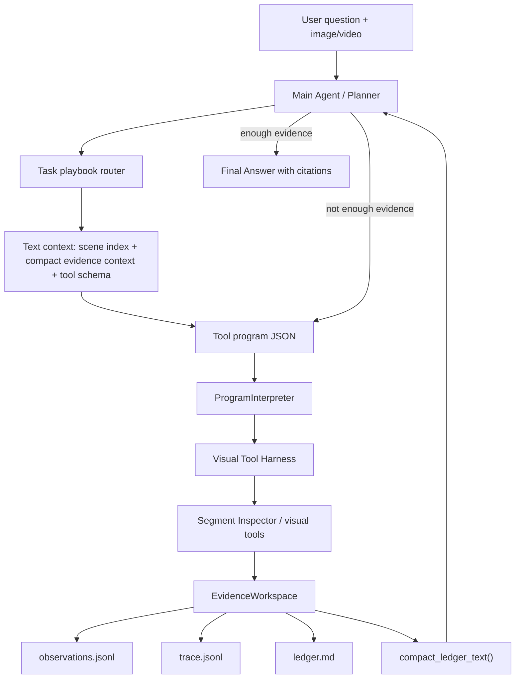
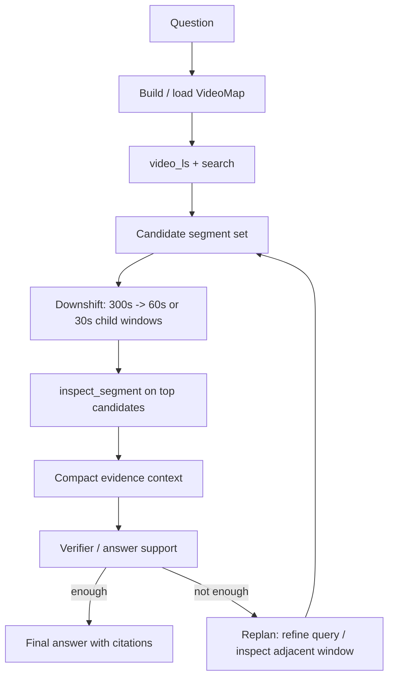

# Claude Code-style Visual Long-video Agent: Flow And Context Management Design

Date: 2026-06-03
Last updated: 2026-06-04

## 一句话定位

我们要做的不是让多模态模型一次性吃完整长视频，而是把 Claude Code 的工作方式迁移到视觉任务：

```text
不把整个代码库塞进模型，而是让 Agent 用 ls/grep/read/edit/test 定位问题。
不把整个长视频塞进模型，而是让 Agent 用 video_ls/search/zoom/inspect/verify 定位证据。
```

因此核心系统能力是：

- 可搜索的视频工作区
- 统一工具协议
- 可追溯证据账本
- 多轮规划和上下文压缩
- 最终答案必须引用证据

## 当前整体流程



当前 Main Agent 是 text-only planner：

- 默认不接收完整视频。
- 它看到的是 `scene_index.summary()`、task playbook、tool schema 和 `compact_ledger_text()`。
- 真正的视频像素访问由 `inspect_segment` / `caption_segment` / `qa_segment` 等工具完成。
- 默认策略是主 planner 派发局部检查任务，Segment Inspector 只回传一条 distilled observation。

## 当前实现状态

截至 2026-06-04，本地代码已实现并测试：

- query-conditioned `video_ls` / `search_segments`，返回 relevance reason、分通道 matches 和 evidence snippet。
- `zoom` 物化 child segments，并写回 mutable `VideoMapStore`。
- `inspect_segment` 作为 Segment Inspector 边界，返回单条 distilled observation。
- `compact_ledger_text()` 生成 planner 用的 bounded context view。
- `question_policy.py` 提供 multiple-choice / temporal-ordering / general-video-QA playbook。
- MCQ options 自动注入 `inspect_segment(candidate_options=...)`。
- `verify_ledger_answer` 有 citation gate 和非 navigation 视觉证据 gate。
- `AgentBudget.free_explore(...)` 支持质量优先的自由探索路径：不做 per-class cost budget，只保留 emergency caps。
- 动态 window 已修复 tail clamp、动态 id 复用、毫秒/秒单位混用等交互问题。
- MCQ 工具调用会把 letter-only `candidate_options` 补成完整选项文本。

远端 KML 机器上已通过完整单测：

```text
82 tests OK
```

远端 VideoMME 小样本已完成多轮调试：

- default AnswerAgent 三例：1/3，final_rate 66.7%，incomplete_rate 33.3%。
- `611-2` free-explore：final_rate 100%，incomplete_rate 0%，但 final A vs GT D。
- free-explore 能召回答案相关证据，包括支持正确选项 D 的 observation；失败点转移到 AnswerAgent/Verifier 的冲突仲裁。

尚未完成：

- 将 `inspect_segment` 升级成内部可多轮 tool-use 的真正 subagent runtime。
- 模型式 entailment / temporal verifier。
- 对更大 VideoMME 切片验证质量提升和效率边界。

这对应 Claude Code 迁移关系：

| Claude Code | Long-video Agent |
| --- | --- |
| `ls` | `video_ls` |
| `grep/search` | `search_segments` |
| `read file` | `read_segment` |
| open local code span | `inspect_segment` preferred, `caption_segment` / `qa_segment` as low-level tools |
| edit/run/test | enrich map / verify answer |
| conversation context | compact evidence context |
| shell trace | trace.jsonl |
| files/artifacts | clips, frames, crops, masks |

## Agent 输入和输出

### 输入

Main Agent 每轮输入：

- 用户问题
- task-type playbook（multiple-choice / temporal-ordering / general video QA）
- 工具 schema
- 当前轮次和预算
- 已检查 segment ids
- 未检查 segment candidates
- Scene index 摘要
- compact evidence context（长期视觉证据、导航摘要、短期工作缓冲）

当前 planner prompt 规则包括：

- 用 `video_ls` 做开放问题或不确定定位。
- `caption_segments` 是离线 VideoMap cache building；在线推理中只在索引为空时使用。
- 导航后优先调用 `inspect_segment`，而不是把中间视觉细节直接放进主 context。
- MCQ 使用 `candidate_options` 传给 `inspect_segment`。
- 不要每轮都只做 navigation。
- final answer 必须引用 observation ids。

### 输出

Main Agent 必须输出 JSON：

继续探索：

```json
{
  "status": "continue",
  "rationale": "why this tool is needed",
  "program": [
    {
      "tool": "inspect_segment",
      "args": {"segment_id": "seg_0004", "candidate_options": ["A. ...", "B. ..."]},
      "assign": "evidence_1"
    }
  ]
}
```

最终回答：

```json
{
  "status": "final",
  "answer": "B. ...",
  "citations": ["obs_0002", "obs_0004"],
  "confidence": 0.72
}
```

当前问题已经从单纯“预算耗尽”变成两层：

- bounded loop 下，模型仍可能继续探索到预算耗尽，而不是稳定 final。
- free-explore 下，模型可以收集更多证据并 final，但仍可能在冲突 observation 中选择错误选项。

## 当前工具组

### 1. Navigation / Video Workspace Tools

`video_ls`

- 给出视频总览、segment 数量、时长、可用索引类型。
- 返回候选 segments、outline、coverage、recommended tools。
- 候选包含 `relevance_reason`，推荐下一步优先是 `inspect_segment` 或 `zoom`。
- 类比代码 Agent 的 `ls`。

`search_segments`

- 在 VideoMap 的 caption/asr/ocr/entities 中做检索。
- 返回每个候选的分通道 `matches`、命中字段、score、evidence snippet。
- 支持 `asr` / `ocr` / `caption` / `visual` / `entities` 等 modality alias。
- 当前仍是 training-free lexical search，后续可替换或补充 embedding retrieval。
- 类比代码 Agent 的 `grep`。

`read_segment`

- 读取某个 segment 的 compact metadata。
- 不访问像素，只读索引。
- 类比 `read file/span`。

`expand_window`

- 扩展时间窗口。
- 兼容保留：只返回 expanded range。

`zoom`

- 把粗 segment 物化成稳定 child segments，例如 `seg_0002_z01`。
- 写回 mutable `VideoMapStore`，后续可被 `video_ls` / `search_segments` 召回。
- 推荐下一步是对 child segment 调用 `inspect_segment`。

### 2. Visual Evidence Tools

`inspect_segment`

- 当前首选的局部视觉证据工具。
- 语义上是 Segment Inspector subagent boundary：内部看局部时间窗，主 planner 只收到一条 distilled observation。
- 接收 `candidate_options`，用于 MCQ 证据归因。
- 返回 `tool_role=segment_inspector`、time range、question、sampling 参数、claim、confidence、limitations。

`caption_segment`

- 低层 VLM 工具：对指定时间段做 caption。
- 可先用 ffmpeg 提取物理 clip，再喂给模型。
- 返回 claim、clip path、time range、nframes、limitations。

`qa_segment`

- 低层 VLM 工具：对指定时间段做 QA。
- 仍可作为 Inspector 内部或兼容路径使用，但主 planner 默认优先调用 `inspect_segment`。

`caption_segments`

- 批量 caption 若干 segments，并写回 mutable VideoMap。
- 用于离线 VideoMap cache building，把空地图变成可搜索地图。
- 在线 loop 中只应在索引为空时使用，避免把稳定记忆构建放进问答预算。
- 当前实现还偏 coarse。

`caption_image / qa_image / caption_region / qa_region`

- 图像和区域级工具已经有基础协议。
- 后续可接 OCR、detector、SAM、tracking。

### 3. Verification / Answer Tools

`summarize_ledger_evidence`

- 从 ledger 中抽取 claim 列表。

`verify_ledger_answer`

- 当前是 lexical support score + citation gate + 非 navigation 视觉证据 gate。
- `inspect_segment`、`caption_segment`、`qa_segment` 都算视觉证据。
- 仍是弱验证。
- 后续应替换为 entailment/temporal verifier。

## Tool Output Protocol

工具返回统一结构：

```python
{
    "claim": "...",
    "confidence": 0.66,
    "input_artifacts": ["..."],
    "regions": [
        {
            "segment_id": "seg_0004",
            "start_sec": 900.0,
            "end_sec": 1200.0,
            "nframes": 8,
            "max_pixels": 151200
        }
    ],
    "limitations": "...",
    "raw_output": {...}
}
```

解释：

- `claim`: 给下一轮 Agent/Answer Agent 读的自然语言证据。
- `confidence`: 工具自评或启发式置信度。
- `input_artifacts`: 原视频、clip、crop、frame 等证据来源。
- `regions`: 结构化时空定位信息。
- `limitations`: 告诉 Answer Agent 这条证据有什么限制。
- `raw_output`: 完整工具输出，写入 `observations.jsonl`，默认不直接塞进 prompt。

## EvidenceWorkspace 设计

每个 run 是一个 evidence workspace：

```text
runs/<run_id>/
  input/
  artifacts/
    frames/
    clips/
    crops/
    masks/
  observations.jsonl
  trace.jsonl
  ledger.md
```

### observations.jsonl

完整 observation：

```json
{
  "observation_id": "obs_0003",
  "tool": "caption_segment",
  "claim": "...",
  "confidence": 0.66,
  "input_artifacts": ["..."],
  "regions": [...],
  "limitations": "...",
  "raw_output": {...},
  "created_at": "..."
}
```

用途：

- 可训练轨迹
- Debug
- 后续 Answer Agent 构造 evidence table
- 可复现工具调用

### trace.jsonl

逐步 trace：

```json
{"type": "iterative_round_start", "payload": {...}}
{"type": "iterative_plan", "payload": {...}}
{"type": "tool_use", "payload": {...}}
{"type": "tool_result", "payload": {...}}
{"type": "iterative_final", "payload": {...}}
```

用途：

- 观察模型 tool-use 行为。
- 统计工具序列。
- 后续 training-free behavior improvement。
- 后续 SFT/RL 的轨迹数据源。

### ledger.md

append-only 原始证据账本：

```text
- `obs_0003` | tool: `qa_segment` | confidence: 0.66 |
  artifacts: clip.mp4 | claim: B. ... | limitations: ...
```

用途：

- 控制 prompt 长度。
- 让模型像 coding agent 一样读“证据摘要”，而不是 raw log。

### compact_ledger_text()

给 planner 下一轮看的 bounded context view：

```text
# Compact Evidence Context

## Long-Term Visual Evidence
- `obs_0003` | tool: `inspect_segment` | claim: ...

## Navigation Summary
- obs_0001: video_ls
- obs_0002: search_segments

## Short-Term Working Buffer
- `obs_0004` | tool: `zoom` | claim: ...
```

设计目标：

- raw `ledger.md` 和 `trace.jsonl` 留在磁盘，不直接塞入主 prompt。
- 主 planner 看到的是分层压缩后的工作记忆。
- navigation-only 结果被折叠成摘要；视觉 evidence 保持可引用的 claim。
- 最近几条 observation 保留在短期缓冲，避免刚发生的工具状态丢失。

## 上下文管理策略

### 当前策略

当前已从最简单的 ledger-based memory 升级为 compact evidence memory：

```text
每轮 prompt =
  tool schema
  + scene index summary
  + task playbook
  + compact_ledger_text()
```

优点：

- 简单。
- 可追溯。
- 不把大 JSON/raw model output 放进上下文。
- 分离 navigation summary 和 answer-facing visual evidence。
- 主 planner 不直接承接 Inspector 内部视觉细节。

当前仍然不足：

- `compact_ledger_text()` 目前是规则压缩，还不是学习式或 entailment-aware 压缩。
- `inspect_segment` 目前是一次 VLM 调用，还不是内部可多轮 tool-use 的真实 subagent runtime。
- Answer/Verifier 仍未完全拆成独立 agent。

### 建议改成三层上下文

#### Layer 1: Working Map

面向 Planner：

```text
video_id
duration
coarse segments
available indexes
top candidates
coverage
already inspected segments
```

来源：

- VideoMap
- subtitle/ASR/OCR/entity/embedding index
- video_ls/search output

目标：

- 决定下一步去哪看。

#### Layer 2: Evidence Table

面向 Answer Agent：

```text
obs_id | time_range | tool | claim | confidence | limitations | artifact
```

只保留可回答问题的证据，不放所有 navigation trace。

目标：

- 支持 final answer。
- 支持 citations。
- 支持 verifier。

#### Layer 3: Full Trace

面向 Debug/Training：

```text
all planner texts
all tool calls
all raw tool outputs
all artifacts
all final answers
```

目标：

- 训练数据。
- 行为分析。
- 复现实验。

不要把 Full Trace 直接塞给模型。

## 推荐的新 Loop

当前 loop：

```text
for round in 1..4:
    planner reads ledger
    planner emits one tool call or final
    interpreter executes one tool
    workspace appends ledger
```

推荐 loop：



## Budget Redesign

Earlier bounded setting:

```text
max_rounds = 4
max_tool_calls_per_round = 1
```

Problem:

- `video_ls`, `read_segment`, and `expand_window` consume the same scarce budget as expensive `qa_segment`.
- A four-step exploration leaves no final answer round.

Earlier recommendation for bounded research:

```text
max_rounds = 8
max_tool_calls_per_round = 2 or 3
reserve_final_round = true
```

Updated recommendation for the current quality-first phase:

```text
free_explore:
  max_rounds = emergency cap
  max_tool_calls_per_round = emergency cap
  no per-class cost budget
  no reserved-final pressure
```

原因是最新 `611-2` 结果显示：工具使用确实能提高证据召回和 final_rate，但不自动提高答案正确率。现在应该先让模型自由探索，暴露证据冲突和 answer/verifier 缺陷；等质量路径跑通后，再把 cost、latency 和 tool budget 放回优化目标。

Tool classes:

```text
cheap tools:
  video_ls
  search_segments
  read_segment
  expand_window
  zoom
  summarize_ledger_evidence

expensive tools:
  inspect_segment
  caption_segment
  qa_segment
  caption_segments
  caption_region
  qa_region

verifier tools:
  verify_ledger_answer
```

Budget policy:

- Allow multiple cheap tools in one round.
- Limit expensive VLM tools by separate budget.
- Preserve at least one final decision round.
- MCQ tasks must call `inspect_segment` before final, with `candidate_options`.

For free-explore experiments, these become analysis metrics rather than hard constraints:

- expensive tool count
- repeated segment count
- unique inspected windows
- conflict rate
- unsupported final rate
- answer latency

这些轨迹后续可用于 Agentic RL，但在 verifier 能过滤好坏轨迹之前，不应直接把长轨迹当正样本。

## Long-video Context Design

### Why Main Agent Should Not Receive Full Video

For very long videos, full-video prompting has three issues:

- Sampling may miss the relevant moment.
- Latency and decoding cost grow.
- The model cannot expose where evidence came from.

Coding Agent analogy:

- Claude Code does not read every file first.
- It lists, searches, reads local spans, edits, runs tests.

Long-video Agent should do the same:

- `video_ls`: what is in the video workspace?
- `search_segments`: where might the answer be?
- `read_segment`: what metadata do we already know?
- `zoom`: materialize smaller child windows when the coarse window is too broad.
- `inspect_segment`: inspect only promising video spans and return one distilled observation.
- `verify`: is the answer supported by cited evidence?

### Proposed Video Map Hierarchy

```text
Video
  Coarse windows: 300s
    Middle windows: 60s
      Fine windows: 10-30s
        Frames / crops / OCR / regions
```

The current experiment used 300s fixed windows. That is enough for initial map-first navigation but too coarse for final QA.

Recommended:

- Use 300s windows for `video_ls`.
- Use subtitle/ASR search to choose candidate windows.
- Automatically split chosen 300s windows into 30-60s child segments.
- Run `inspect_segment` on child segments.
- If still ambiguous, inspect adjacent child windows.

## Answer Agent Design

Current:

- 已有轻量 text-only AnswerAgent / final-answer wiring。
- bounded loop 下仍可能因为 `max_rounds_reached` incomplete。
- free-explore 下可以 final，但可能选择错误的冲突 observation。

Problem:

- Partial answer can accidentally include an option letter.
- Navigation claims and evidence claims are mixed.
- There is no strict final-validation stage.
- `supported_option` 可能来自弱 caption / 推断，而不是明确视觉证据。
- AnswerAgent 需要比较整张 evidence table，而不是只引用最近或最顺手的一条 observation。

Recommended Answer Agent:

Input:

```text
question
options if MCQ
evidence table
candidate observations
limitations
required citation format
```

Output:

```json
{
  "answer": "D",
  "rationale": "...",
  "citations": ["obs_0002", "obs_0005"],
  "missing_evidence": [],
  "confidence": 0.74
}
```

Rules:

- Cannot cite `video_ls` alone as visual evidence.
- Must cite at least one visual/ASR/OCR/QA observation.
- For MCQ, final answer must start with option letter.
- If evidence is insufficient, output `need_more_evidence`, not a guessed answer.
- If the ledger contains conflicting supported options, explain the conflict and either resolve it with cited evidence or request targeted follow-up.
- If an observation limitation says the claim is inferred, lacks explicit cues, or depends on external knowledge, do not treat its `supported_option` as decisive.

## Verifier Design

Current verifier:

- lexical overlap between answer and compact evidence context.
- citation gate.
- non-navigation visual-evidence gate.
- useful as a rule baseline, not enough for temporal/multi-evidence entailment.

Recommended verifier:

1. Evidence sufficiency check:
   - Are citations present?
   - Are cited observations from relevant time ranges?
   - Is at least one observation visual/ASR/OCR evidence rather than navigation?

2. Option consistency check for MCQ:
   - Does answer letter match rationale?
   - Does cited evidence support the selected option?
   - Are conflicting observations present?
   - Does any uncited high-confidence observation support a different option?
   - Does the cited observation itself admit weak grounding in `limitations`?

3. Temporal consistency check:
   - For ordering questions, extract event order from evidence table.
   - Compare with option sequences.

4. Optional model-based entailment:
   - Use the same or smaller model to judge support.
   - Keep verifier prompt text-only over evidence table, not raw video.

## Training-free Behavior Improvement

Before training, we can improve behavior through:

- Better tool descriptions.
- Stronger planner policy.
- Budget separation.
- Evidence table formatting.
- Automatic candidate expansion.
- Tool-use guardrails.

Concrete policy improvements:

```text
For MCQ:
1. Call video_ls/search.
2. Select top 2-3 candidate segments.
3. Call inspect_segment on candidates with candidate_options.
4. Summarize evidence.
5. Build an evidence table grouped by supported option.
6. Verify selected option against conflicts and limitations.
7. Final only if supported; otherwise ask a targeted follow-up.
```

Bad patterns to penalize:

- repeating `read_segment` on the same segment
- using `video_ls` twice without a new query
- finalizing from navigation-only evidence
- exhausting budget without `inspect_segment`
- finalizing from a weak caption while conflicting option evidence exists
- treating letter-only `candidate_options` as enough for MCQ evidence attribution

## Trainable Traces

The harness already creates useful data for later SFT/RL:

```text
question
planner prompt
planner JSON action
tool schema
tool result
observation id
ledger state
final answer
correctness / verifier score
```

Possible training targets:

- tool selection policy
- stop/final decision
- evidence citation behavior
- search query generation
- coarse-to-fine localization
- answer verification behavior

Training-free phase should first produce high-quality traces with deterministic workflow rules. Then we can train or preference-optimize.

Updated stance: in the current phase, no-budget/free-explore traces are valuable because they reveal the model's natural tool-use ceiling and evidence conflicts. They are not yet efficiency targets. Before Agentic RL, filter trajectories by evidence support, conflict resolution, and verifier verdict.

## Current Experimental Takeaway

Historical 2026-06-03 three-case baseline:

- Direct full-video sparse baseline: 2/3.
- Empty-index Agent loop: 2/3 but mostly incomplete.
- Subtitle-index Agent loop: 0/3 and all incomplete.

2026-06-04 updates:

- Default AnswerAgent three-case run: 1/3, final_rate 66.7%, incomplete_rate 33.3%.
- Prefinal AnswerAgent probe was negative: 0/3, final_rate 0%, incomplete_rate 100%; keep disabled by default.
- Free-explore `611-2`: final_rate 100%, incomplete_rate 0%, final A vs GT D.
- The free-explore trace retrieved a D-supporting observation, but final synthesis cited a later A-supporting observation.

This does not mean the architecture is wrong.

It means the current implementation is still a weak planner:

- bounded mode still has too little tool budget
- too much navigation-only behavior
- AnswerAgent/Verifier do not yet arbitrate conflicting MCQ evidence
- compact evidence context is rule-based and not yet entailment-aware
- task-aware MCQ policy helps tool calls but does not guarantee final correctness
- coarse windows too large for final QA

The positive signal is stronger now: free exploration can call tools repeatedly, inspect diverse windows, and retrieve answer-bearing evidence. The next bottleneck is converting that evidence into a verified answer.

## Optimization Roadmap

### P1: Make Agent Loop Answer-capable

- Keep free-explore as a quality-first path.
- Use bounded budget only as an efficiency ablation.
- Task-aware MCQ policy is implemented via `question_policy.py`; continue remote validation.
- Require `inspect_segment`.
- Treat `max_rounds_reached` as incomplete.

### P2: Improve Context Management

- `compact_ledger_text()` now separates long-term visual evidence, navigation summary, and short-term working buffer.
- Next: make compaction relevance-aware and entailment-aware.
- Next: promote richer `video_ls` candidates/outline into a structured working map, not just ledger claims.

### P3: Improve Long-video Tools

- Coarse 300s map.
- `zoom` now materializes child 60s/30s windows locally.
- Frame/clip cache.
- Subtitle/ASR index.
- OCR index.
- Embedding retrieval.

### P4: Improve Verification

- MCQ option verifier.
- Conflict detector over supported options.
- Temporal order verifier.
- Citation sufficiency checker.
- Model-based entailment over evidence table.

### P5: Evaluation

- Repeat the same 3 cases after each policy change.
- Add more VideoMME long cases by task type.
- Track direct vs agent accuracy, final rate, incomplete rate, tool cost, latency, and localization quality.

## Report-friendly Summary

The current system is best described as:

```text
A working long-video visual tool harness with traceable evidence,
but not yet a strong answer agent.
```

What works:

- Qwen3-VL remote backend can run through the harness.
- Tool calls, trace, observations, ledger, and artifacts are generated.
- The Agent can perform map-first exploration and sometimes inspect non-initial segments.
- Local harness now has query-conditioned search evidence, materialized `zoom`, `inspect_segment`, compact evidence context, and task playbooks.

What does not work yet:

- The Agent may still fail to answer before budget exhaustion in bounded mode.
- In free-explore mode, the Agent can answer but may choose the wrong option from conflicting evidence.
- `inspect_segment` is a one-shot isolated VLM call, not yet an internal multi-tool subagent.
- Verification still lacks model-based entailment and temporal consistency.

Main next step:

```text
Turn the prototype from "exploration loop" into "evidence-grounded QA loop"
by adding stronger Answer/Verifier conflict arbitration, then measuring budget/efficiency later.
```
