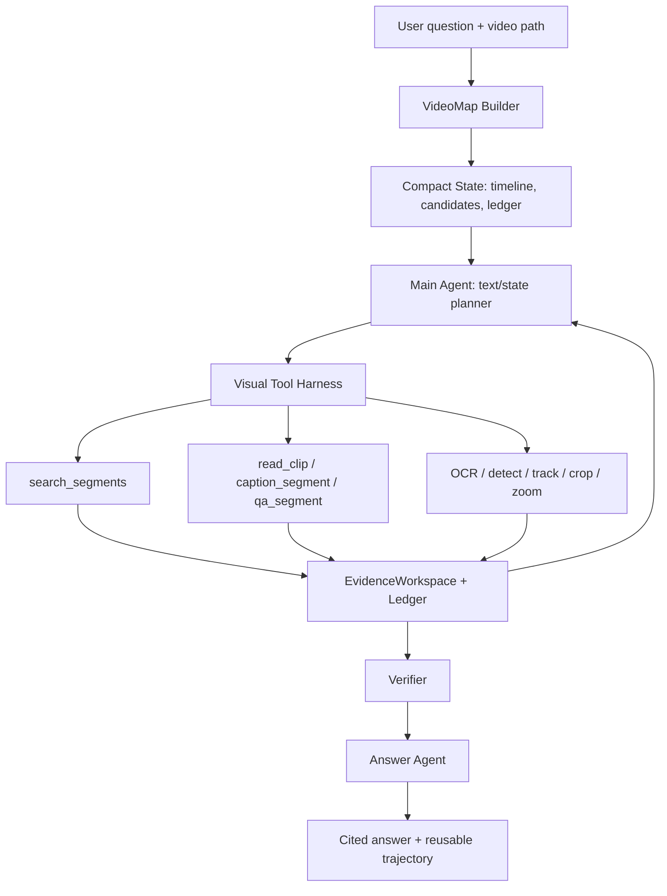

# Coding Agent to Long-Video Agent Design

## Goal

This document defines the high-level design for migrating coding-agent capabilities to a multimodal long-video agent. It is intentionally not an implementation checklist. The purpose is to clarify the backbone pieces we need before refining each visual tool.

Core thesis:

> A long video should be treated like a large codebase. The main agent should not load the whole video into context. It should navigate a structured video workspace, inspect local evidence through tools, maintain a ledger, and answer only from cited observations.

## Related Long-Video Agent Patterns

This design follows a synthesis of several current long-video agent/RAG lines:

- [VideoAgent: Long-form Video Understanding with Large Language Model as Agent](https://arxiv.org/abs/2403.10517) emphasizes iterative planning and retrieval over pushing all frames into one context; its zero-shot result uses only a small average number of frames because the agent actively gathers relevant evidence.
- [VideoAgent: A Memory-augmented Multimodal Agent for Video Understanding](https://videoagent.github.io/) builds structured temporal and object memory, then exposes tools such as caption retrieval, segment localization, VQA, and object memory querying.
- [Video-RAG](https://video-rag.github.io/) shows the value of concise auxiliary text from captions, OCR, ASR, and objects as a plug-in retrieval layer for long-video LVLMs.
- [VideoTree](https://github.com/Ziyang412/VideoTree) contributes the idea of query-adaptive, hierarchical video representation, including low-rate captions and visual features before LLM reasoning.
- [LongVideo-R1](https://huggingface.co/papers/2602.20913) frames long-video understanding as active navigation from top-level summaries to selected clips, and uses generated tool trajectories for later SFT/RL.
- [VideoStir](https://arxiv.org/abs/2604.05418) points beyond flat segment retrieval toward structured spatio-temporal graphs and intent-aware relevance scoring.

Our near-term implementation keeps the training-free part: build a compact map, let the agent navigate it, inspect only local clips/segments, write evidence, then replan. Later we can turn successful traces into SFT/RL tool-use data.

## Why The Coding Agent Analogy Matters

Coding agents work on large repositories without reading every file. They rely on:

- A workspace view: files, folders, diffs, tests, logs.
- Search and navigation: `rg`, file tree, symbols, line ranges.
- Local reads: inspect one file slice or function at a time.
- Tool execution: run tests, formatters, scripts, git commands.
- Trace and evidence: command outputs, file edits, failing tests, passing tests.
- Iteration: plan, inspect, edit, verify, replan.

For super-long videos, the same pattern is needed:

- A video workspace: timeline, shots, clips, keyframes, ASR, OCR, captions, entities.
- Search and navigation: retrieve candidate segments by query, object, text, speaker, event, or time.
- Local reads: inspect a short clip, selected frames, crop, region, or high-fps window.
- Tool execution: caption, VQA, OCR, detect, track, crop, sample, verify.
- Trace and evidence: observations, artifacts, segment ids, timestamps, confidence, limitations.
- Iteration: plan, inspect, write evidence, replan, answer with citations.

The main design consequence is:

> Main Agent = planner/controller over compact state. Visual tools = pixel/video readers. EvidenceWorkspace = working memory.

## Capability Migration Map

| Coding Agent capability | Video Agent counterpart | Backbone needed |
| --- | --- | --- |
| Repo tree | VideoMap timeline | duration, segments, hierarchy, artifacts |
| `rg` search | `search_segments(query)` | text/visual/audio embeddings, ASR/OCR/captions |
| Read file slice | `read_clip(segment_id)` | ffmpeg clip extraction, frame sampling |
| Read nearby lines | `expand_window(segment_id, before, after)` | temporal neighborhood API |
| Symbol index | entity/event/text/speaker index | detectors, ASR, OCR, VLM captions |
| Test command | verifier tools | answer support, temporal consistency, contradiction checks |
| Git diff / traces | evidence ledger | observation jsonl, trace jsonl, artifacts |
| Subagents | scout/localizer/perception/verifier workers | shared workspace and tool protocol |
| Context management | compact VideoMap and ledger | summarization, budget, truncation policy |
| Tool-use learning | trace-to-training data | SFT/RL examples from successful trajectories |

## Target Architecture



The important constraint is that `Main Agent` should default to text/state planning. It can be a VLM model family for fair model-size comparison, but its planner request should not include the full video. The video is only touched by tools that read local clips, frames, crops, or indexed signals.

## Backbone 1: VideoMap

`VideoMap` is the video equivalent of a repository index. It should be cheap to build first, then progressively enrich.

Minimal schema:

```json
{
  "video_path": "/path/video.mp4",
  "duration_sec": 3169.06,
  "segments": [
    {
      "segment_id": "seg_0001",
      "start_sec": 0.0,
      "end_sec": 300.0,
      "source": "fixed_window",
      "keyframe_paths": ["runs/x/artifacts/frames/seg_0001.jpg"],
      "low_fps_caption": "",
      "asr_text": "",
      "ocr_text": "",
      "entities": [],
      "embedding_refs": []
    }
  ]
}
```

Levels:

- Level 0: duration, fixed windows, keyframes.
- Level 1: shot boundaries, low-fps captions, ASR, OCR snippets.
- Level 2: visual/text/audio embeddings for retrieval.
- Level 3: object tracks, event graphs, speaker/entity timelines.

Design rule:

> VideoMap is allowed to be incomplete. It only needs enough structure for the agent to choose the next local read.

## Backbone 2: Navigation API

The main agent should call navigation tools similar to how coding agents call search and file readers.

Core navigation tools:

- `video_ls(query="", max_segments=16, top_k=5)`: map-first overview of duration, segment count, modality coverage, bounded timeline outline, candidate segments, and recommended next tools.
- `search_segments(query, top_k, modalities)`: retrieve candidate segments from captions, ASR, OCR, entities, and embeddings.
- `read_segment(segment_id)`: return compact metadata, keyframes, coarse captions, and prior observations.
- `expand_window(segment_id, before_sec, after_sec)`: inspect temporal neighborhood.
- `sample_frames(segment_id, nframes)`: produce local frames as artifacts.
- `extract_clip(segment_id, start_sec, end_sec)`: produce a short video artifact for VLM tools.

These are not all perception tools. Some are workspace navigation tools, analogous to `ls`, `rg`, and `sed -n`.

### Why `video_ls` Is A Critical Tool

For a coding agent, `ls` is not just a file listing. It is the first compression of a large workspace into navigable structure. For a long-video agent, `video_ls` should play the same role:

- It tells the planner whether the current map has captions, ASR, OCR, entities, keyframes, or embeddings.
- It returns a bounded outline sampled across the full timeline instead of dumping the first N segments.
- It optionally accepts the user question as `query` and returns candidate segments from lexical or future embedding search.
- It recommends next actions such as `read_segment`, `caption_segment`, `qa_segment`, or `expand_window`.
- It writes a compact Observation into the ledger, so the next planning round can refine from evidence rather than starting over.

Current implementation:

```json
{
  "tool": "video_ls",
  "args": {
    "query": "describe aircraft museum",
    "max_segments": 12,
    "top_k": 5
  }
}
```

Returns:

```json
{
  "coverage": {
    "segment_count": 11,
    "duration_sec": 3169.06,
    "field_counts": {
      "low_fps_caption": 11,
      "asr_text": 0,
      "ocr_text": 0,
      "entities": 0
    }
  },
  "outline": [
    {"segment_id": "seg_0001", "start_sec": 0.0, "end_sec": 300.0, "summary": "..."}
  ],
  "candidates": [
    {"segment_id": "seg_0004", "score": 0.67, "matched_fields": ["low_fps_caption"]}
  ],
  "recommended_next_tools": [
    {"tool": "read_segment", "args": {"segment_id": "seg_0004"}},
    {"tool": "caption_segment", "args": {"segment_id": "seg_0004"}}
  ]
}
```

The intended workflow is:

```text
video_ls(query) -> read_segment(candidate) -> caption_segment/qa_segment(candidate) -> ledger -> replan
```

This differs from simple video retrieval because the output is formatted for an autonomous planner and is immediately tied to traceable tool calls.

## Backbone 3: Visual Tool Harness

The harness owns tool schema, argument validation, artifact writing, and trace logging.

Tool categories:

- Structural tools: `ffprobe_duration`, `fixed_window_index`, `shot_detect`, `extract_clip`, `sample_frames`.
- Semantic tools: `caption_segment`, `qa_segment`, `caption_frame`, `qa_region`.
- Text tools: `ocr_frame`, `ocr_region`, `asr_segment`.
- Spatial tools: `crop_region`, `zoom_region`, `detect_objects`, `segment_mask`.
- Temporal tools: `track_object`, `compare_segments`, `temporal_verify`.
- Retrieval tools: `embed_segment`, `retrieve_segments`, `retrieve_frames`.
- Verification tools: `verify_answer`, `verify_temporal_order`, `check_ledger_support`.

Important separation:

- Tool implementation can use VLMs, smaller specialist models, or traditional algorithms.
- Tool contract should hide backend details from the planner.
- Tool output must always become an `Observation`.

Observation requirements:

```json
{
  "observation_id": "obs_0001",
  "tool": "caption_segment",
  "claim": "The segment shows an aircraft museum exhibit.",
  "confidence": 0.72,
  "input_artifacts": ["runs/x/artifacts/clips/seg_0002.mp4"],
  "regions": [{"segment_id": "seg_0002", "start_sec": 300.0, "end_sec": 600.0}],
  "limitations": "Low fps sample; fine-grained motion may be missed."
}
```

## Backbone 4: Main Agent Planning State

The main agent should receive compact state, not raw video:

```json
{
  "question": "What is the video mainly about?",
  "video_map_summary": "...",
  "candidate_segments": [
    {"segment_id": "seg_0004", "reason": "caption mentions aircraft"},
    {"segment_id": "seg_0008", "reason": "OCR mentions aviation history"}
  ],
  "already_inspected": ["seg_0001", "seg_0002"],
  "ledger_summary": [
    {"observation_id": "obs_0001", "segment_id": "seg_0001", "claim": "..."}
  ],
  "remaining_budget": {
    "rounds": 3,
    "tool_calls": 4,
    "high_fps_calls": 1
  },
  "allowed_tools": ["search_segments", "caption_segment", "qa_segment", "expand_window", "verify_answer"]
}
```

Planner output:

```json
{
  "status": "continue",
  "rationale": "Need focused evidence from the candidate segment mentioning aircraft history.",
  "program": [
    {
      "tool": "qa_segment",
      "args": {
        "segment_id": "seg_0008",
        "question": "What is this segment mainly about?",
        "nframes": 8
      },
      "assign": "focused_qa"
    }
  ]
}
```

Final output:

```json
{
  "status": "final",
  "answer": "...",
  "citations": ["obs_0003", "obs_0005"],
  "confidence": 0.78
}
```

Harness-side policies:

- Do not pass full video to the planner by default.
- Cap tool calls per round.
- Avoid repeated segments unless the planner explicitly cites a failed observation.
- Escalate from low-fps to high-fps only after a segment has evidence relevance.
- Prefer `search_segments` before exhaustive segment captioning.
- Require final citations from `ledger.md`.

## Backbone 5: Evidence Workspace

The workspace should preserve every artifact needed for replay, audit, and training.

Artifacts:

- Original video reference.
- Extracted clips.
- Sampled frames.
- Crops, masks, tracks.
- OCR/ASR outputs.
- Tool raw outputs when safe and compact.

Logs:

- `observations.jsonl`: evidence claims.
- `trace.jsonl`: planner/tool events with timestamps.
- `ledger.md`: answer-facing evidence summary.
- `run_config.json`: model, budget, VideoMap version, tool versions.
- `metrics.json`: wall time, VLM calls, frames sampled, failures.

This is the video analogue of a coding agent worktree plus command trace.

## Backbone 6: Cooperative Agents

The multi-agent split should follow responsibility boundaries, not model count.

Recommended roles:

- Main Planner: text/state controller, chooses next action.
- Video Scout: builds or enriches VideoMap, proposes candidate segments.
- Localizer: turns question into retrieval queries and temporal hypotheses.
- Perception Worker: runs VLM/OCR/detect/track tools on local artifacts.
- Verifier: checks whether ledger supports the answer and whether time/order claims are consistent.
- Answer Agent: generates final answer strictly from cited observations.

Fast calling strategy:

- Keep one shared VLM backend loaded for main model comparisons.
- Use traditional tools and smaller specialist models as separate lightweight workers.
- Run independent segment captioning in parallel only after candidate selection.
- Cache all tool observations by `(tool, segment_id, args hash)`.
- Keep planner context compact by passing ledger summaries rather than raw outputs.

## Backbone 7: Training-Free Behavior Improvement

Before training, improve behavior through harness constraints and feedback:

- Tool schema validation: reject hallucinated tool names and bad args.
- Planner prompt contract: explicit continue/final schemas.
- Exploration policy: no repeated segment without reason.
- Budget policy: at most N calls per round.
- Evidence policy: final answers must cite observations.
- Verifier feedback: if evidence is insufficient, planner receives a structured gap.

This gives a training-free loop:

```text
plan -> validate -> execute -> observe -> verify/gap -> replan
```

## Backbone 8: Trace-To-Training Data

Once the harness produces reliable trajectories, convert traces into training examples.

SFT data:

- Input: question + VideoMap summary + ledger + budget.
- Target: next tool-use JSON or final answer JSON.
- Positive examples: trajectories that answer correctly with compact evidence.
- Negative examples: repeated segment requests, unsupported final answers, over-broad tool calls.

RL or preference data:

- Reward for correct answer, cited evidence, fewer frames, fewer VLM calls.
- Penalty for unsupported claims, repeated segments, full-video calls, budget exhaustion.
- Preference pairs: direct full-video failure vs tool-use success, repeated exploration vs targeted retrieval.

The goal is not to train perception first. It is to improve planning behavior over tools.

## End-To-End Workflow

Recommended long-video flow:

1. Build minimal VideoMap.
2. Retrieve candidate segments from the question.
3. Main Planner reads compact state and chooses one local action.
4. Harness validates args, resolves segment ids, and executes tool.
5. Tool writes artifact and observation.
6. Ledger is updated.
7. Verifier checks support or reports evidence gap.
8. Main Planner replans with updated state.
9. Answer Agent writes cited final answer.
10. Trace is saved for analysis and possible training.

## Baselines And Evaluation

Baselines:

- Direct VLM full-video or sampled-video QA.
- Single-pass visual program.
- Iterative text-only planner with local tools.
- Iterative planner plus retrieval index.
- Iterative planner plus verifier and Answer Agent.

Metrics:

- Accuracy.
- Evidence support quality.
- Number of planner calls.
- Number of tool calls.
- Total sampled frames.
- Clip seconds decoded.
- Wall time.
- GPU memory and utilization.
- Failure tags: bad retrieval, repeated exploration, insufficient evidence, hallucinated tool, weak perception, verifier rejection.

### Description Ablation

The first runnable ablation is intentionally simple:

1. `direct_full_video`: ask the same Qwen-VL backend to describe the full video in one request.
2. `map_first_explore`: use a text-only planner with `video_ls`, ledger reading, and focused segment tools.

Both strategies share one loaded backend so the comparison is about tool-use and context management, not model size. The runner writes:

- `runs/<run_id>/comparison.json`
- `runs/<run_id>_explore/ledger.md`
- `runs/<run_id>_explore/observations.jsonl`
- `runs/<run_id>_explore/trace.jsonl`

The scientific question is whether `video_ls` plus iterative local inspection produces a more complete and better-cited description than direct long-video prompting, especially for videos where important events are sparse or late in the timeline.

## Difference From VisProg, ParaVT, And Retool-Style Systems

VisProg-style systems are valuable for expressing visual programs, but they are usually short-horizon and image-centric. Our harness keeps the visual-program idea while adding persistent workspace, ledger, trace, and iterative replanning.

ParaVT-style parallelism is useful for throughput, but parallel captioning alone is not enough. We need a controller that decides when parallelism is worth the cost and how to cite evidence.

Retool-style tool improvement focuses on learning tool-use behavior. Our design can use that later, but first emphasizes training-free behavior constraints, replayable evidence, and long-video navigation.

The distinctive point is:

> The unit of reasoning is not a single model response. It is a reproducible evidence trajectory over a video workspace.

## Open Design Questions

- How much VideoMap should be built upfront versus on demand?
- Should candidate retrieval use caption/ASR/OCR text first, or visual embeddings first?
- When should the planner be allowed to request high-fps or full-resolution clips?
- Should verifier be a separate model, rule-based first, or both?
- How should repeated segment requests be handled when the user question truly requires revisiting a segment?
- What is the best trace format for SFT/RL conversion?

## Immediate Next Documents Or Plans

Recommended follow-up docs:

1. `VideoMap` schema and artifact layout.
2. Navigation tool protocol: `video_ls`, `search_segments`, `read_segment`, `expand_window`.
3. Segment tool execution policy: physical clip extraction, caching, and timing metrics.
4. Verifier and Answer Agent contract.
5. Trace-to-SFT/RL data conversion spec.
