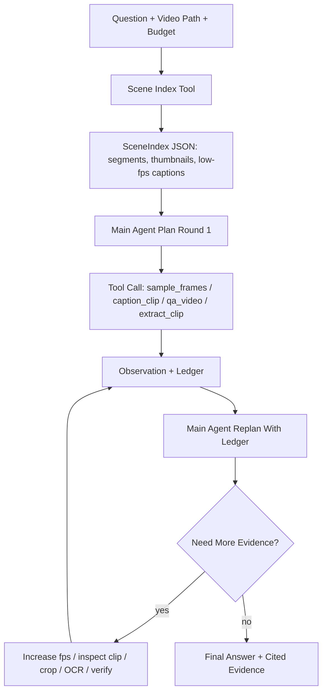

# Long-Video Iterative Agent Implementation Plan

> **For agentic workers:** REQUIRED SUB-SKILL: Use superpowers:subagent-driven-development (recommended) or superpowers:executing-plans to implement this plan task-by-task. Steps use checkbox (`- [ ]`) syntax for tracking.

**Goal:** Build a testable long-video tool-use harness that lets a visual main agent iteratively inspect scene-level evidence, request higher-fps or clip-level tools where needed, and compare against a direct VLM baseline.

**Architecture:** Keep the current `VisualAgent` as the single-pass baseline and add a separate iterative controller. The controller reads/writes the existing `EvidenceWorkspace`, starts from a cheap scene index, loops over `plan -> tool -> observe ledger -> replan`, and stops by answer confidence, budget, or max rounds.

**Architecture reference:** See `plans/2026-06-03-coding-agent-to-video-agent-design.md` for the higher-level migration design from coding-agent repository navigation to long-video workspace navigation.

**Tech Stack:** Python standard library, current harness registry/workspace/interpreter, ffmpeg/ffprobe for traditional video tools, Qwen3-VL backend for VLM caption/QA tools.

---

## Design Summary

The long-video agent should not send the whole video at high FPS on every call. It should use a coarse-to-fine policy:

1. Build or load a low-cost video index.
2. Ask the main agent to choose which segment/tool to inspect.
3. Execute one or more tools.
4. Append observations to ledger.
5. Replan from the ledger.
6. Stop with an answer and cited observation IDs.

The main agent can still be from a VLM model family, but the planner request should default to text/state input: question, scene index, inspected segments, budget, and compact ledger. Raw video should be read by local tools such as clip captioning, OCR, detection, tracking, and verification.

## Proposed Flow



## Core Concepts

### Scene Index

`SceneIndex` is a cheap, persistent manifest:

```json
{
  "video_path": "/path/video.mp4",
  "duration_sec": 1860.2,
  "segments": [
    {
      "segment_id": "seg_0001",
      "start_sec": 0.0,
      "end_sec": 30.0,
      "keyframe_path": "runs/x/artifacts/frames/seg_0001.jpg",
      "low_fps_caption": "Opening title and establishing shot",
      "source": "fixed_window"
    }
  ]
}
```

P1 should use fixed windows plus ffmpeg keyframes first. TransNet/shot detection can come later as a drop-in `scene_detector`.

### Tool Budget

Every run has a budget:

```json
{
  "max_rounds": 4,
  "max_vlm_calls": 8,
  "default_nframes": 8,
  "high_fps_nframes": 32,
  "max_clip_sec": 90
}
```

The agent may request a high-cost tool only after referencing a segment or evidence gap.

### Tool Granularity

P1 tools:

- `build_scene_index(video_path, window_sec=30)`
- `video_ls(query="", max_segments=16, top_k=5)`
- `search_segments(query, top_k=5, modalities=[])`
- `read_segment(segment_id)`
- `expand_window(segment_id, before_sec=30, after_sec=30)`
- `caption_segment(video_path, start_sec, end_sec, nframes=8)`
- `qa_segment(video_path, start_sec, end_sec, question, nframes=8)`
- `sample_frames(video_path, start_sec, end_sec, fps or nframes)`
- `extract_clip(video_path, start_sec, end_sec)`
- `verify_answer(answer, ledger_text)`

P2 tools:

- `ocr_frame_or_region(image_path, bbox)`
- `detect_objects(frame_path)`
- `crop_region(image_path, bbox)`
- `caption_frame(image_path)`
- `qa_region(image_path, bbox, question)`

P3 tools:

- `shot_detect_transnet(video_path)`
- `retrieve_segments(query, scene_index)`
- `parallel_caption_segments(segment_ids)`
- `temporal_verify(event_claim, segment_ids)`

## Implementation Phases

### Phase 1: Iterative Controller Skeleton

**Goal:** Add a deterministic iterative controller using mock backend/tools.

**Files:**

- Create: `src/visual_coding_agent_harness/agents/iterative_agent.py`
- Create: `src/visual_coding_agent_harness/video_index.py`
- Create: `tests/test_iterative_agent.py`
- Modify: `src/visual_coding_agent_harness/tools/video_atomic.py`
- Modify: `src/visual_coding_agent_harness/tools/traditional.py`

**Acceptance Criteria:**

- Controller runs at least two rounds.
- Round 1 consumes a scene index.
- Round 2 uses ledger evidence to decide final answer.
- Output includes `rounds`, `tool_calls`, `observation_ids`, `answer`, `citations`.

### Phase 2: Scene Index Tool

**Goal:** Build a low-cost long-video index without loading the VLM on the whole video.

**Implementation:**

- Use `ffprobe` for duration.
- Split into fixed windows, default `window_sec=30`.
- Extract one keyframe per segment with ffmpeg.
- Optional: run low-fps caption only on selected segments, not all segments.

**Why fixed windows first:** It gives deterministic coverage and avoids blocking on TransNet. Later `shot_detect_transnet` can replace `fixed_window`.

### Phase 3: Segment-Level VLM Tools

**Goal:** Avoid asking Qwen3-VL to inspect the full long video for every tool call.

**Implementation:**

- `caption_segment` extracts a temporary clip or passes video metadata with bounded start/end when supported.
- Default: extract clip with ffmpeg to `runs/<id>/artifacts/clips/seg_x.mp4`.
- Then call Qwen backend on the short clip with `nframes=8`.
- Escalation mode: `nframes=32` only for selected clip.

**Why:** This directly tests whether harness decomposition helps versus direct full-video QA.

### Phase 4: Replanning Prompt

**Goal:** Let the main agent read the ledger and decide next action.

**Prompt Inputs:**

```json
{
  "question": "...",
  "video_path": "...",
  "scene_index_summary": "...",
  "ledger": [
    {"observation_id": "obs_0001", "tool": "caption_segment", "claim": "..."}
  ],
  "remaining_budget": {"rounds": 2, "vlm_calls": 4},
  "allowed_next_tools": ["qa_segment", "caption_segment", "verify_answer"]
}
```

**Planner Output:**

```json
{
  "status": "continue",
  "rationale": "Need to inspect the segment mentioning the Wright brothers.",
  "program": [
    {
      "tool": "qa_segment",
      "args": {
        "segment_id": "seg_0012",
        "question": "What is this segment mainly about?",
        "nframes": 32
      },
      "assign": "focused_qa"
    }
  ]
}
```

Final output:

```json
{
  "status": "final",
  "answer": "...",
  "citations": ["obs_0002", "obs_0004"],
  "confidence": 0.78
}
```

### Phase 5: Direct Baseline Runner

**Goal:** Measure whether tool-use helps.

**Baselines:**

1. `direct_full_video`: Qwen3-VL answers the video question directly with same default nframes.
2. `single_pass_tool`: current `VisualAgent`.
3. `iterative_tool`: new controller.
4. `iterative_tool_high_fps`: same controller with escalation allowed.

**Metrics:**

- Accuracy on benchmark answer.
- Number of VLM calls.
- Total sampled frames.
- Total wall time.
- Evidence citation quality.
- Failure mode tags: bad scene retrieval, hallucinated tool, insufficient evidence, decoding failure.

Current implemented comparison runner:

```bash
PYTHONPATH=src python3 -m visual_coding_agent_harness.cli.description_comparison \
  --model-path /m2v_intern/xuboshen/models/Qwen3-VL-4B-Instruct \
  --media-path /path/to/video.mp4 \
  --question "Describe the video." \
  --duration-sec 3169.06 \
  --window-sec 300 \
  --max-rounds 4 \
  --direct-nframes 64 \
  --max-pixels 151200 \
  --extract-clips \
  --base-dir . \
  --run-id qwen_description_compare
```

It records `direct_full_video` and `map_first_explore` in `runs/<run_id>/comparison.json`. The exploration run writes evidence under `runs/<run_id>_explore/`.

### Phase 6: VideoMME Long Smoke

**Goal:** Run a small but meaningful benchmark slice.

**Initial Dataset:**

- VideoMME long subset.
- Start with 3 examples, then 10, then full long split.

**Commands:**

```bash
python -m visual_coding_agent_harness.cli.direct_vlm_baseline \
  --model-path /m2v_intern/xuboshen/models/Qwen3-VL-4B-Instruct \
  --media-path /path/to/video.mp4 \
  --question "What is the video mainly about?"
```

```bash
python -m visual_coding_agent_harness.cli.iterative_vlm_agent \
  --model-path /m2v_intern/xuboshen/models/Qwen3-VL-4B-Instruct \
  --media-path /path/to/video.mp4 \
  --question "What is the video mainly about?" \
  --max-rounds 4 \
  --default-nframes 8 \
  --high-fps-nframes 32
```

## What This Tests Scientifically

The core question is not "can we make an agent call tools?" We already can. The question is:

1. Does decomposition improve answer accuracy over direct VLM?
2. Does the ledger reduce hallucination by forcing evidence citation?
3. Does coarse-to-fine sampling improve long-video efficiency?
4. Does high-fps escalation help only when targeted?
5. Are failures caused by planning, retrieval, tool execution, or model perception?

## Risks And Controls

- **Risk:** More VLM calls help only because compute budget is larger.
  **Control:** Report VLM calls, frames sampled, and wall time.

- **Risk:** Scene index misses the important moment.
  **Control:** Include fallback broad sample and segment retrieval metrics.

- **Risk:** Main agent hallucinates tool args.
  **Control:** Normalize media paths, validate segment IDs, reject unknown tools.

- **Risk:** Long-video decoding is unstable.
  **Control:** Prefer clip extraction and frame sampling artifacts over repeated random seeks.

- **Risk:** Tool observations are just another paraphrase from the same model.
  **Control:** Add traditional tools and exact frame/clip citations.

## Recommended Next Commit

Start with Phase 1 + Phase 2 only:

1. Add `SceneIndex`.
2. Add `build_scene_index` fixed-window tool.
3. Add `IterativeVisualAgent` with mock backend.
4. Add direct baseline runner.
5. Run on one VideoMME long sample without loading Qwen for every segment.

This gives the first real comparison:

- direct answer
- single-pass caption tool
- iterative scene-index + focused caption/QA
